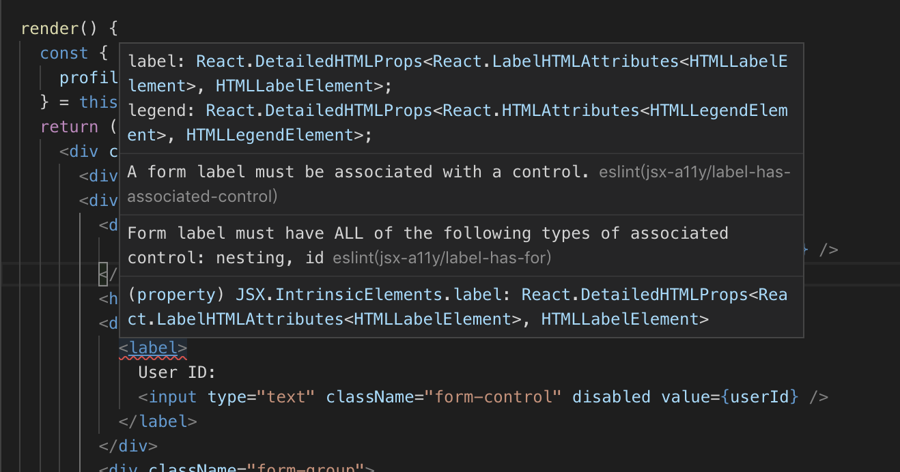

## 如果eslint中發現某個rule已經deprecated，該如何處理？

我們都知道eslint的好處

但是在這變化快速的時代

eslint所用的rule也常常更新

但有時候原作者是將舊rule標為deprecated而不是直接刪除

我們在安裝哪些plugin的時候就會一併將新舊rule一起裝進來了

這時候可能會在編輯器發現這樣的錯誤提示



我們好奇這個rule的詳細說明點進官方文件發現原來其中一個已經deprecated!!

靠已經不用還放進package裡面!（心裡默默罵幹）

好啦罵歸罵事情還是要解決

於是我們按照官方文件給的選項調整還能怎麼做呢？

就是直接在設定檔取消那個rule

以上面圖為例

label-has-for是已經deprecated的rule

所以我們在.eslintrc / eslintrc.json中把加入一行把這個rule的值設定成0

如下方代碼中第二行rule設定

```
"rules": {
    "react/jsx-filename-extension": [1, { "extensions": [".js", ".jsx"] }],
    "jsx-a11y/label-has-for": 0,
    "prettier/prettier": ["error"]
  }
```

如此便可以甩開已經不用的rule

繼續開心coding了:)
